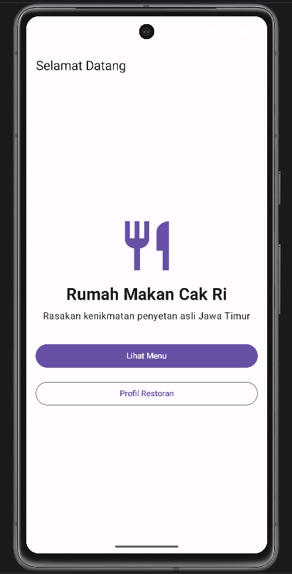
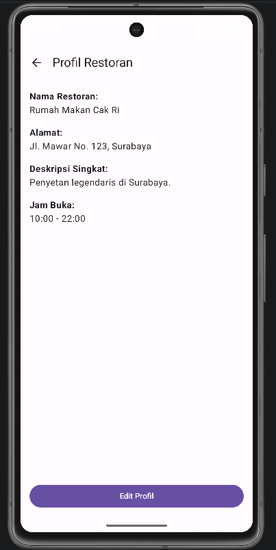

# Rumah Makan Cak Ri

Aplikasi Android sederhana untuk pemesanan makanan.

## Fitur
- Menampilkan menu makanan
- Navigasi antar halaman
- UI menggunakan Jetpack Compose 

## Screenshot Aplikasi

.png)

## Cara Menjalankan

1. Clone repository
2. Buka Android Studio
3. Sync Gradle
4. Jalankan emulator
